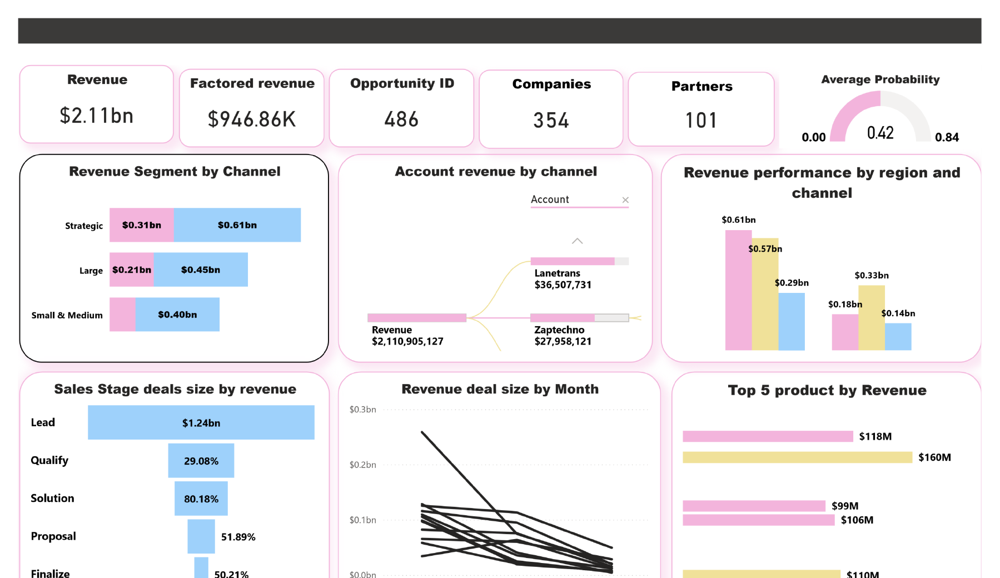
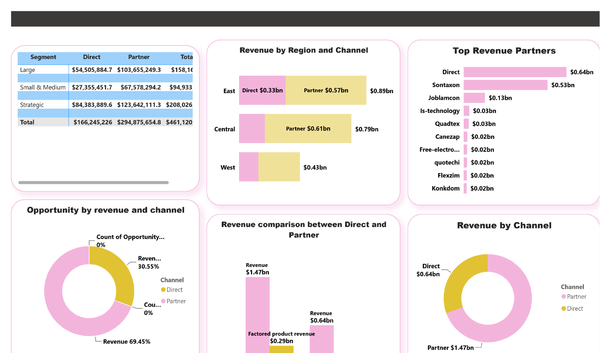
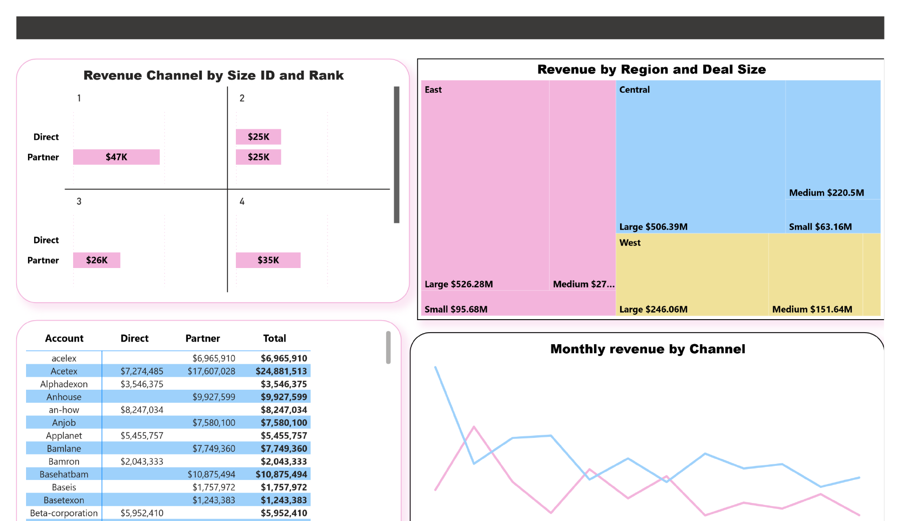

# Sales Opportunity Tracking Dashboard

Power BI dashboard that tracks a sales pipeline: where revenue comes from (Direct vs Partner channels), which regions and partners perform best, and where deals get stuck.

## Dashboard preview

## Key numbers

- Total revenue: $2.11bn
- Opportunities: 486
- Companies: 354
- Partners: 101
- Average win probability: 0.42

## Key findings

- **Partners bring in most of the revenue.** The Partner channel brings $1.47bn (69.45%) and the Direct channel brings $0.64bn (30.55%).
- **East is the top region** with $0.89bn, followed by Central ($0.79bn) and West ($0.43bn).
- **Revenue depends on a few partners.** Sontaxon alone brings $0.53bn, about a quarter of all revenue, and Joblamcon brings $0.13bn. Every other partner in the top 10 brings $0.03bn or less.
- **Large deals matter most.** In every region, Large deals bring in the most revenue (East $526M, Central $506M, West $246M).
- **The pipeline is top-heavy.** Most of the revenue value sits in the Lead stage ($1.24bn), and the funnel shrinks a lot at each later stage.

## Recommendations

- Improve how leads are qualified and followed up, so more deals move past the early stages.
- Strengthen solution positioning and closing, to turn more opportunities into revenue.
- Improve co-selling with partners, since the Partner channel brings in most of the revenue.
- Reduce the risk of relying on a few partners by growing the smaller ones.

## Tools

Power BI
